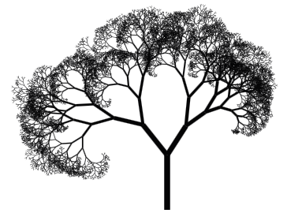

# to·pi·ar·y
/ˈtōpēˌerē/ 

noun

1. A shrub or tree clipped or trimmed into fantastic shapes.



## Description

A JavaScript module for creating simple procedurally generated trees.

## Usage

`npm install @walsh9/topiary --save`

###example.html

```html
<canvas id="canvas" width="500" height="500">
<script src="example.js">
```

###example.js

```javascript
    var treeOptions = {
      canvas: document.getElementById("canvas"),
      startPoint: Topiary.Vector2d.new(250, 500),
      color: Topiary.Color.random(),
      height: 100,
      thickness: 10,
      depth: 14,
      rainbow: false,
      colorShiftRate: 30,
      delay: 200,
    };
    var mutationOptions = {
      minLeftAngle: 10,
      maxLeftAngle: 40,
      minRightAngle: 20,
      maxRightAngle: 40,
      minHeightChange: 0.6,
      maxHeightChange: 0.9,
      minThicknessChange: 0.6,
      maxThicknessChange: 0.9,
    };
    var tree = Topiary.new(treeOptions, mutationOptions);
    tree.draw();
```
## Helpers

```javascript
    var color1 = Topiary.Color.new(h, s, l);
    var color2 = Topiary.Color.random();
    var point = Topiary.Vector2d.new(x, y);
```

## License

© Matt Walsh 2015-2016, released under the MIT License